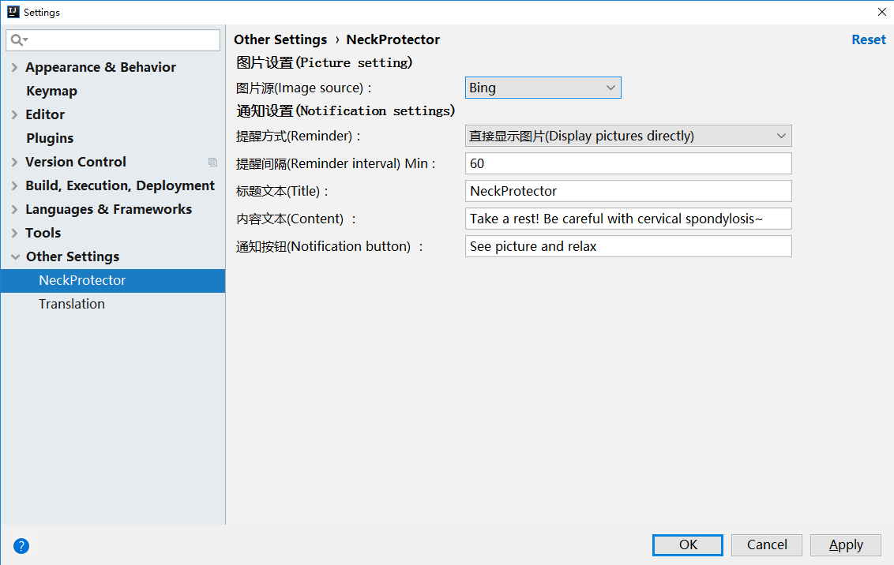
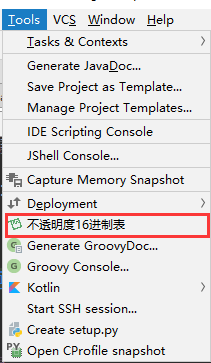
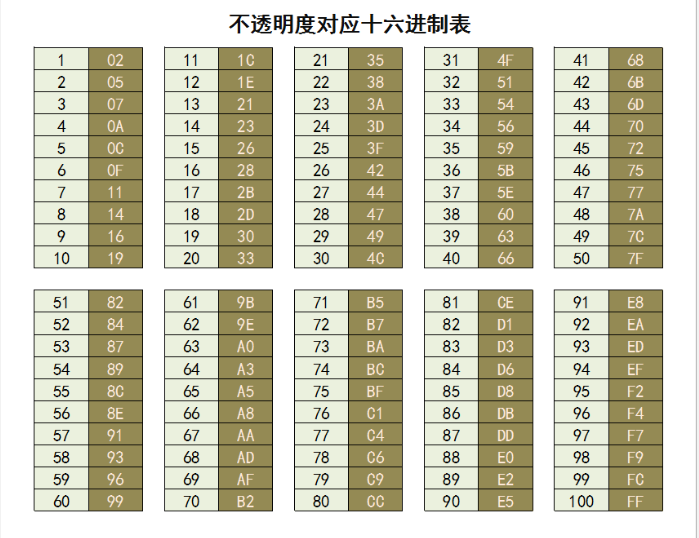

# NeckProtector
### A  IntelliJ IDEA plugin that reminds you to rest.

定时提醒工作中的你注意休息，活动活动肩颈，远离各种肩颈毛病~~

特性列表
----
* [x] 定时提醒
* [x] 可自定义提醒图片(支持Bing每日美图)
* [x] 可自定义提醒方式
* [x] 可自定义提醒时间
* [x] 可自定义提醒文案

安装
----
- **使用 IDE 内置插件系统安装:**
  - <kbd>进入IDE设置页面(Settings)</kbd> > <kbd>Plugins</kbd> > <kbd>Browse repositories...</kbd> > <kbd>搜索并找到"NeckProtector"</kbd> > <kbd>Install Plugin</kbd>

重启**IDE**.

配置
----

附加工具
----
此附加工具为了部分童鞋定制。
- 不透明度对应的16进制表 

TODO:
- 增加Bing图片定时刷新获取功能
