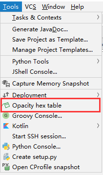

# NeckProtector
### A  IntelliJ IDEA plugin that reminds you to rest.

定时提醒工作中的你注意休息，活动活动肩颈，远离各种肩颈毛病~~

Features 特性列表
----
* [x] Reminder / 定时提醒
* [x] Customizable reminder pictures (support Bing daily photos) / 可自定义提醒图片(支持Bing每日美图)
* [x] Customizable reminder / 可自定义提醒方式
* [x] Customizable reminder time / 可自定义提醒时间
* [x] Customizable reminder copy / 可自定义提醒文案

Installation / 安装
----
- **Install using the IDE built-in plugin system / 使用 IDE 内置插件系统安装:**
  - <kbd>进入IDE设置页面(Settings)</kbd> > <kbd>Plugins</kbd> > <kbd>Browse repositories...</kbd> > <kbd>搜索并找到"NeckProtector"</kbd> > <kbd>Install Plugin</kbd>

Restart / 重启**IDE**.

Configuration / 配置
----

Additional tool / 附加工具
----
- Hexadecimal table corresponding to opacity 不透明度对应的16进制表 

TODO:
- Increase Bing image daily refresh acquisition function / 增加Bing图片每日刷新获取功能
